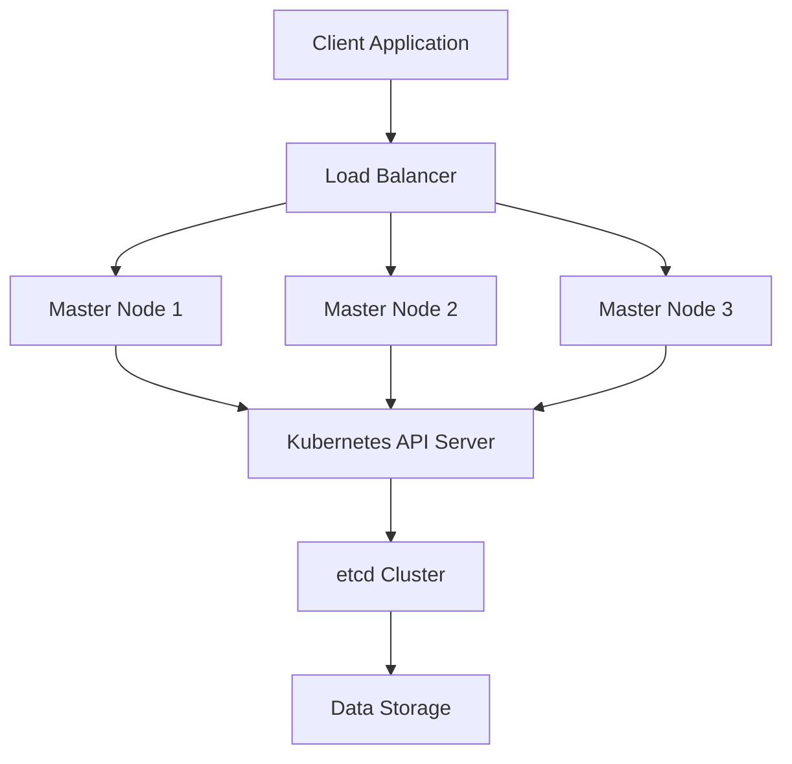

# Kubernetes Master Node High Availability Setup on RHEL

## Objective

The objective of this project is to set up a high-availability Kubernetes master node cluster on Red Hat 
Enterprise Linux (RHEL). This setup will ensure that the Kubernetes control plane remains available and 
operational even if one of the master nodes fails.


## Project Overview

1.  **Planning and Preparation**
    
    -   Define requirements and prepare the RHEL environment.
    -   Install Kubernetes and its components.
2.  **Install and Configure Kubernetes Control Plane**
    
    -   Set up multiple master nodes.
    -   Configure Kubernetes API Server, Controller Manager, and Scheduler.
3.  **Configure etcd for High Availability**
    
    -   Set up an etcd cluster to store Kubernetes state.
4.  **Set Up Load Balancer**
    
    -   Configure a load balancer to distribute traffic among master nodes.
5.  **Testing and Validation**
    
    -   Verify cluster high availability.
    -   Test failover scenarios.
6.  **Documentation and Conclusion**
    
    -   Document the setup process.
    -   Evaluate benefits, challenges, and performance.

## Step-by-Step Configuration

### 1. Planning and Preparation

-   **Install RHEL**: Ensure RHEL is installed and updated on all master nodes.
-   **Update System**:
    
    `sudo yum update -y` 
    

### 2. Install and Configure Kubernetes Control Plane

#### On Each Master Node

-   **Install Kubernetes Packages**:
    
    `sudo yum install -y kubeadm kubelet kubectl
    sudo systemctl enable kubelet` 
    
-   **Initialize the Kubernetes Cluster**: On the first master node:    
    `sudo kubeadm init --control-plane-endpoint <load-balancer-ip>:<port> --upload-certs` 
    
    Save the output, including the `kubeadm join` command with the token and certificate key.
    
-   **Set Up kubeconfig**: On the first master node:

    
    `mkdir -p $HOME/.kube
    sudo cp -i /etc/kubernetes/admin.conf $HOME/.kube/config
    sudo chown $(id -u):$(id -g) $HOME/.kube/config` 
    
-   **Install a Network Plugin**: For example, using Calico:

    `kubectl apply -f https://docs.projectcalico.org/manifests/calico.yaml` 
    

#### On Additional Master Nodes

-   **Join the Cluster**: Use the `kubeadm join` command from the first master node’s output:
    
    `sudo kubeadm join <load-balancer-ip>:<port> --control-plane --certificate-key <certificate-key>` 
    

### 3. Configure etcd for High Availability

#### On Each etcd Node

-   **Install etcd**: Follow the official etcd installation guide for your RHEL version.
    
-   **Configure etcd Cluster**: Edit `/etc/etcd/etcd.conf` and configure each node with a unique 
`ETCD_NAME` and `ETCD_INITIAL_CLUSTER`.
    
-   **Start etcd**:    
    `sudo systemctl start etcd
    sudo systemctl enable etcd` 
    

### 4. Set Up Load Balancer

#### On the Load Balancer Node

-   **Install and Configure HAProxy**:

    
    `sudo yum install haproxy -y` 
    
    Edit `/etc/haproxy/haproxy.cfg`:
   
    
    ```frontend kubernetes_api
        bind *:6443
        default_backend kubernetes_master
    
    backend kubernetes_master
        balance roundrobin
        server master1 <master1-ip>:6443 check
        server master2 <master2-ip>:6443 check
        server master3 <master3-ip>:6443 check
        ``` 
    
-   **Start and Enable HAProxy**:

    
    `sudo systemctl start haproxy
    sudo systemctl enable haproxy` 
    

### 5. Testing and Validation

-   **Verify Cluster Status**: On any master node:
    `kubectl get nodes` 
    
-   **Test Failover**: Stop the Kubernetes API server on one of the master nodes and ensure that the 
cluster remains available and operational through the load balancer.
    

### 6. Documentation and Conclusion

-   **Document Configuration**: Record all installation and configuration steps, including Kubernetes 
setup, etcd configuration, and load balancer settings.
-   **Evaluate Benefits**:
    -   **High Availability**: Ensures the Kubernetes control plane remains operational even if a master 
node fails.
    -   **Scalability**: Easily scale the number of master nodes as needed.
-   **Challenges**:
    -   **Configuration Complexity**: Setting up and managing a high-availability Kubernetes cluster can 
be complex.
    -   **Network Configuration**: Proper network setup is crucial for cluster communication and load 
balancing.
